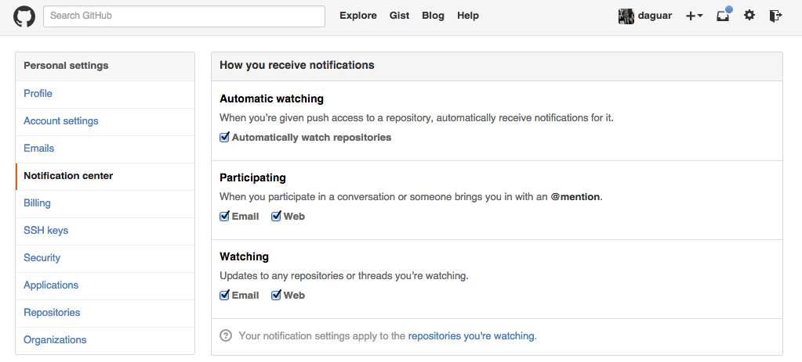
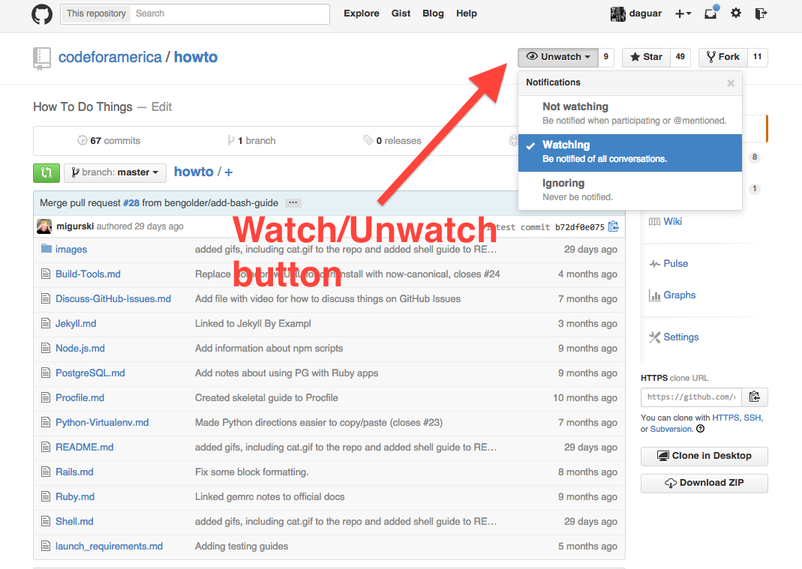
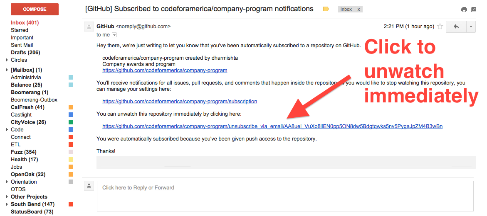
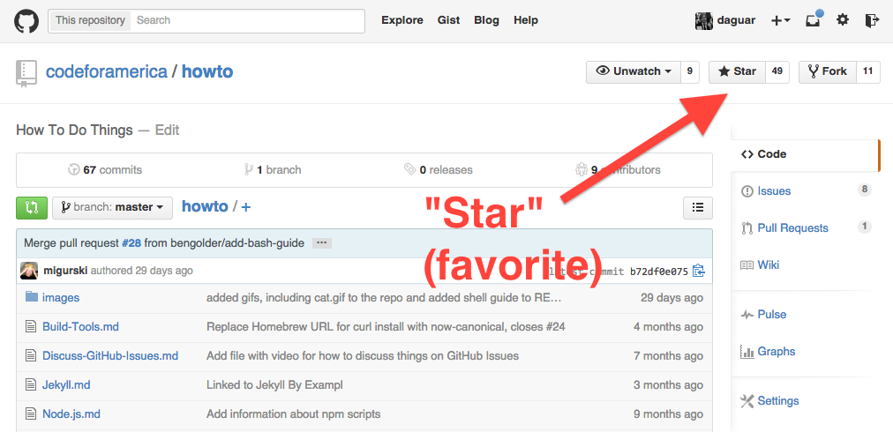

# GitHub Notifications

GitHub's notifications can be confusing. Here's a quick explanation.

## Recommended notifications

The recommended setup is the default, in which you receive an email for:

- **Watched repos**: any activity on repositories you have chosen to "watch"
- **@ mentions**: any time someone mentions your username (like @daguar)

To make sure this is your setup, go to notification settings ( [https://github.com/settings/notifications](https://github.com/settings/notifications) ) and make sure it looks like:

With this setup, you'll also see a stream of notifications activity on the front page of GitHub at [www.github.com](https://github.com/).

## "Watching" repos (subscribing to email notifications)

To "watch" (get emails) or "unwatch" (unsubscribe to emails) for a repo, go to the repo page and click the button :

## Automatic watching

If you have "Automatic watching" turned on (see the top screenshot), GitHub will automatically subscribe you to "watch" any repo that someone gives you access to.

When you are automatically subscribed you will get an email that also lets you easily unsubscribe with one click, like this:

## "Starring" (favoriting a repo)

If you want to remember that a repo exists, but don't want to get notifications for it, then you can "star" it, which is like adding it to your favorites:

Your starred repos are all available at: [https://github.com/stars](https://github.com/stars)

