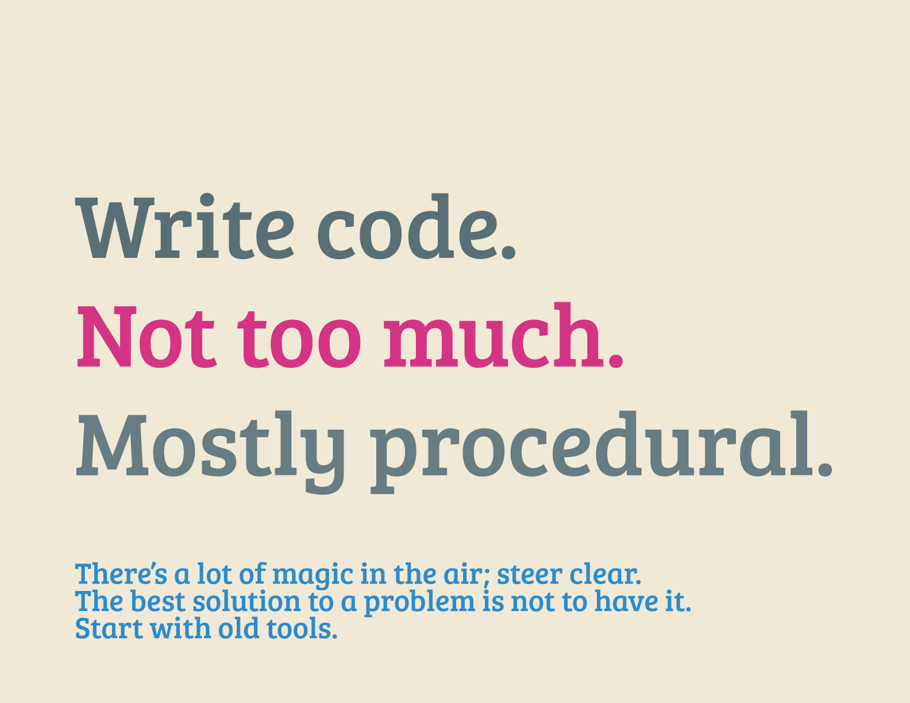

How To Do Things With Computers
=====

Simple guides to foundational tech tasks for Code for America projects.

The guides here serve two purposes:

1. Code for America software documentation should **link here for common tasks** like setting up a dev environment or framework. We prefer a tightly-edited, central collection of the most common tasks to everyone re-writing their own versions.
2. Guides here should be normative, describing the simplest, lowest-friction ways of getting common things done. If your app or library doesn’t work with the directions here, consider whether you can **modify your app so that it works** rather than making a change to a guide.

Current Guides
--------------

* [Python Virtualenv](Python-Virtualenv.md), an isolated working copy of Python which allows you to work on a specific project without worry of affecting other projects.
* [Ruby](Ruby.md), for the Ruby programming language and its version manager to install, manage, and work with multiple ruby environments.
* [Node.js](Node.js.md), for the Node server-side Javascript framework.
* [Local PostgreSQL](PostgreSQL.md), for local installation of the open source object-relational database system.
* [Jekyll](Jekyll.rb), a static website builder that runs Github Pages.
* [Build Tools](Build-Tools.md), for core software development tools Make and GCC needed by many downstream libraries and installation processes.

Future Guides
-------------

Suggest new guides in the [codeforamerica/howto Github repository](https://github.com/codeforamerica/howto).

